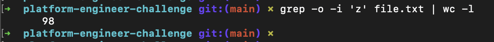

# Junior Platform Engineer Challenge

This repository provides a demonstration of the ability to manipulate and analyze a file using Linux commands, in order to achieve the requirements of the proposed challenge.

This repository contains 2 main files. The first is the `file.txt` file where we have a random string. In addition to executing each linux command directly from the command line to obtain the answers to the challenge questions, a bash script was also created to automate the execution of the commands and obtain the challenge answers in the same way.

- [Junior Platform Engineer Challenge](#junior-platform-engineer-challenge)
  - [Commands used in the challenge and results](#commands-used-in-the-challenge-and-results)
    - [1. How many lines in this file?](#1-how-many-lines-in-this-file)
    - [2. How many “Z” Characters in this file?](#2-how-many-z-characters-in-this-file)
    - [3. Find on which line is “Junior”, “Platform” and “Engineer”, not case sensitive.](#3-find-on-which-line-is-junior-platform-and-engineer-not-case-sensitive)
    - [4. Change “Junior” to “Senior”](#4-change-junior-to-senior)
  - [Run with script](#run-with-script)
  - [Used commands](#used-commands)
  - [How to execute the script](#how-to-execute-the-script)
  - [Improvements](#improvements)

## Commands used in the challenge and results

### 1. How many lines in this file?
```
awk 'END { print NR }' file.txt
```


### 2. How many “Z” Characters in this file?

- Upper case 'Z' characters
```
grep -o 'Z' file.txt | wc -l
```


- Lower case 'z' characters
```
grep -o 'z' file.txt | wc -l
```


- All 'z' characters
```
grep -o -i 'z' file.txt | wc -l
```


### 3. Find on which line is “Junior”, “Platform” and “Engineer”, not case sensitive.
```
grep -E -hnr -i 'junior|platform|engineer' file.txt
```


### 4. Change “Junior” to “Senior”
```
sed -i '' 's/Junior/Senior/g' file.txt && grep -E -hnr -i 'junior|senior' file.txt
```


## Run with script

Scripts are useful for simplifying a series of commands and automating repetitive tasks. If we start using more and more commands to do certain things, running a script will make it easier to perform what we need to, every time. In addition, with automated scripts, we can increase efficiency, save time and reduce errors by eliminating the need for humans to perform essential but repetitive tasks.

The `run.sh` script performs the following actions:

- First, the script checks whether a file has been passed. If no file is passed, it just terminates with status exit 1.
- If the file is passed, it starts executing each command as:  
  - Count the number of lines in the file `file.txt`;
  - Count the number of occurrences of the character "Z" (uppercase and lowercase);
  - Find which lines the words "Junior", "Platform" and "Engineer" occur in, not case sensitive;
  - Check if the operating system is Darwin or Linux;
  - Create a backup file called `file-output.txt` and replace the occurrence of "Junior" with "Senior" - for being able to run many times the same script.

## Used commands

- `awk`: Scripting language, helpful when working in the command line. Used also for text processing.
- `grep`: "global regular expression print", used for searching and matching text patterns in files.
- `wc`: it stands for "Word count". It can also count characters and lines.
- `sed`: It stands for stream editor, it can perform multiple operations on files like search, find, replace, insertion or deletion.


## How to execute the script

For you to be able to run the local run.sh script, you will first need to clone this repository with the following command:

```
git clone https://github.com/baarbarab/platform-engineer-challenge.git
```

After that, go to the cloned repository and you'll be able to see the script and the file.

```
cd platform-engineer-challenge/
```

Once you've done that, you'll be able to run the script by passing the `file.txt` that's in the same directory as the script.

```
./run.sh file.txt
```

If you receive an error like: `permission denied: ./run.sh` you will need to run the command `chmod +x` because by default bash scripts are not executable when created.

```
chmod +x run.sh
```

Be aware that executing the script without specifying any files as arguments will result in an error message and the script will terminate with the status exit 1, indicating a failure during execution.

## Improvements

**Performance Optimization**: During my exploration of commands such as `grep`, `sed` and `awk`, I discovered alternatives such as `tr` and `perl` that offer potentially superior performance. A future improvement could involve looking for commands that stand out in terms of efficiency, especially when dealing with large files.

**Script Refactoring**: Consider refactoring the script to improve its readability, maintainability and scalability. This may include adopting functions to minimize code duplication and simplify the script structure.